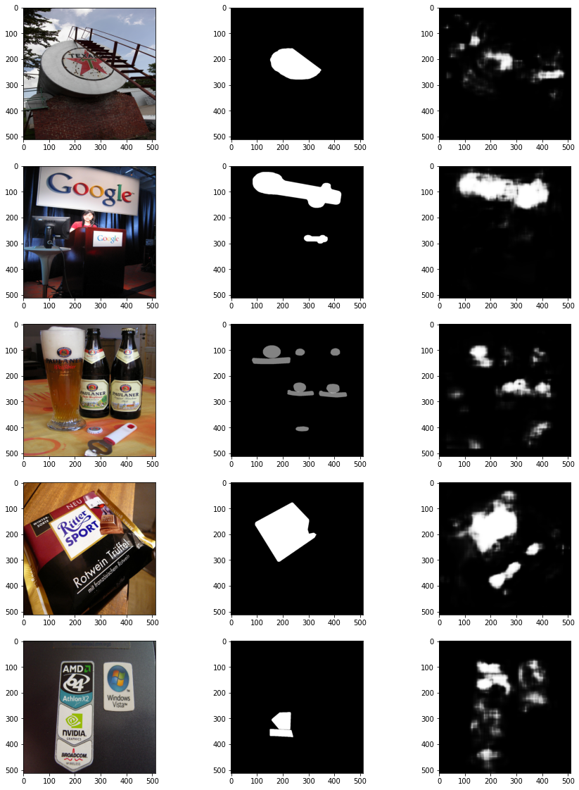

# LogoEraser
Description: Detect the logo in the video and erase it using adjacent pixels.
----------------
### dataset: https://www.uni-augsburg.de/de/fakultaet/fai/informatik/prof/mmc/research/datensatze/flickrlogos/

----------------
### Logo Segmentation by SegNet

